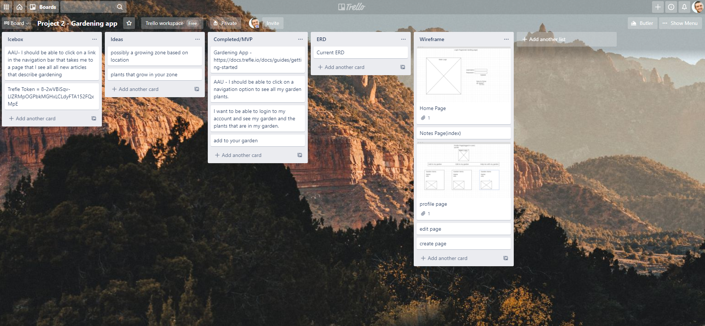
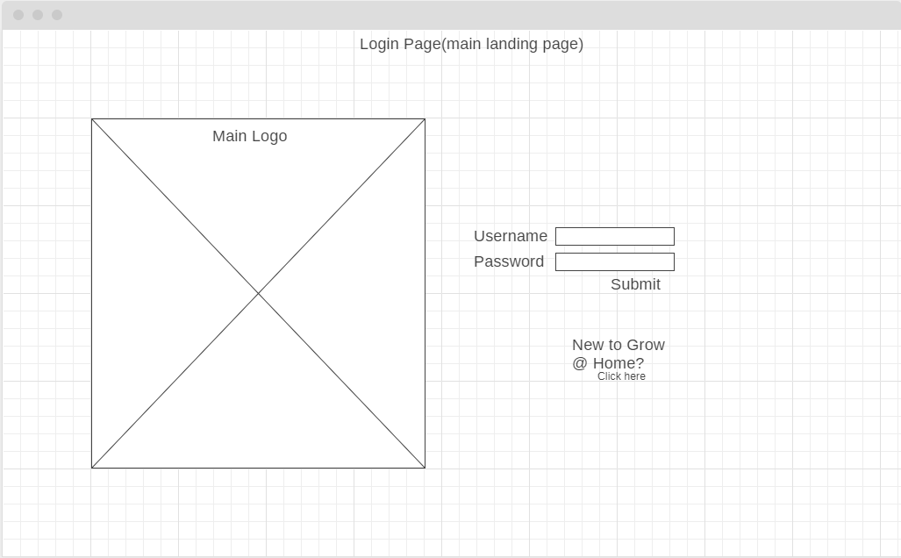
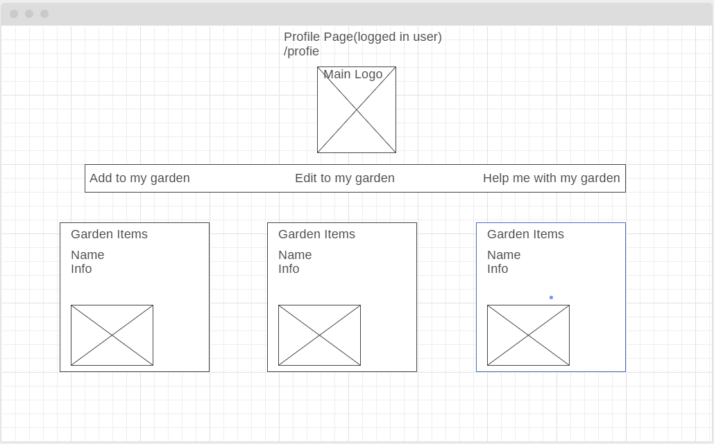

# project-2
a simple web application where you can post your garden as you plant

## Technologies Used
- HTML 5
- CSS3
- JavaScript
- Node.js
- Express
- Mongoose/Mongo
- Trello Board
- Wireframe
- Heroku
- Google Fonts

## Screenshots

## Getting started

<a href="https://my-gardening-app.herokuapp.com/">Click here to see the deployed app!</a>

Future Enhancements
user profile page
posts users name
enhance the design of the posts page
add more features (e.g. likes/favorites)
the ability to upload pictures
link to seed ordering database

# Explanation
I used node.js with express to create a an app where the user can create a login and be able to use the app to post within the app.

with node.js and express I was able to utilize mongoDB to create a database to store information like users and posts.

i used CSS to style my page and HTML/ejs to display my information.

Approach
I use the Trello board to design the approach a user would take once inside the app. I was able to design it with a Wireframe. With those two ready I was able to move forward with my node.js and express app to input my functionality.